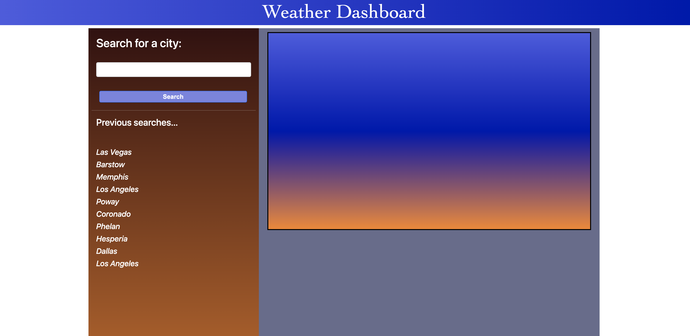

This repository contains files relating to the Weather Dashboard. I have satisfied some of the acceptance criteria in the following manner...

• GIVEN a weather dashboard with a form input, WHEN the user searches for a city, they are presented with current weather conditions for that city and that city is added to the search history.
• WHEN the user views current weather conditions for that city, they are presented with the city name, the date, the temperature, the humidity, and the wind speed

• Here is a screenshot of the 'Dashboard'...

• Here is a link to deployed 'Scheduler': https://kpl33.github.io/weather_dashboard/